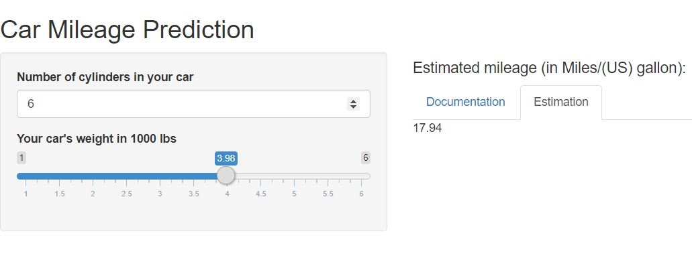

## Objective

This is a part of submission required to pass [Data Science Specialization track](https://www.coursera.org/specializations/jhu-data-science), Coursera.

The final submission for **Developing Data Products** course requires us to:
- Build a shiny app and host it on shinyapp server
- Build a reproducible pitch presentation of the app

The criterias for passing this submission are:
1. App should have some form of input 
2. Some operation on server.R based on inputs
3. SOme reactive output displayed as a result of server calculations
4. Include Documentation
5. Documentation should be in the shiny appitself

## Data

Data used for the mileage prediction is the classic mtcars dataset in R. Mtcars data was extracted from the 1974 Motor Trend US magazine, and comprises fuel consumption and 10 aspects of automobile design and performance for 32 automobiles (1973-74 models).

## Model

Following linear regression model was used for mileage prediction. Note that the residual standard error along with the F-statistics and it's p-value were found to be better when compared to introducing other car features.
So, this model should predict the mileage with a good accuracy.

`lm(mpg~cyl+wt,data=mtcars)`

## Shiny Application 

The location of the shiny app is here: (https://vermaph.shinyapps.io/Mileage_prediction/)

## Thank You