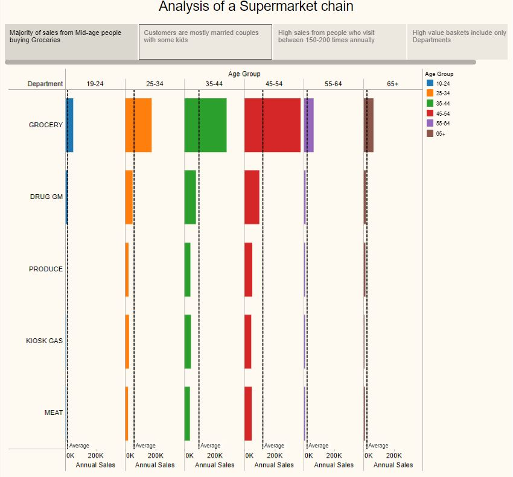
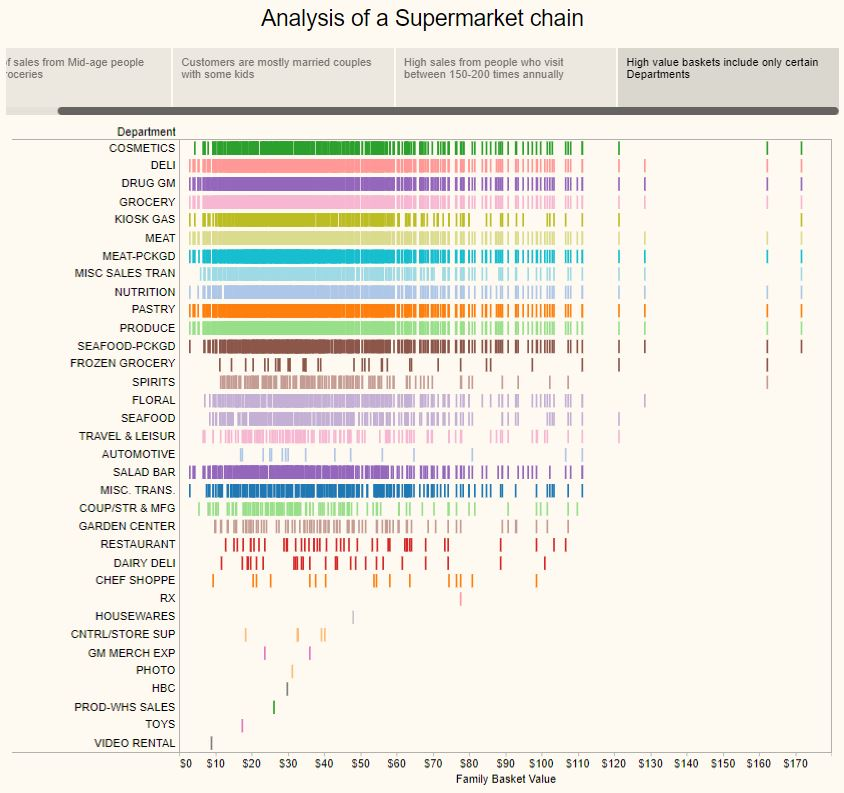

<style>
body {
text-align: justify}
</style>


```{r setup, include=FALSE}
knitr::opts_chunk$set(echo = TRUE)
```


## **Introduction**

Retail supermarkets constantly need to know about their customers and shopping behavior. The idea is simply to retain their loyalty and at the same time stretch them to spend more and attract more new customers. 

A customer can become loyal only when he/she feels personalized: when they get things from supermarket according to their needs. For example if a customer buys a lot of cereals from a particular brand, upon receiving a discount on his/her next purchase for the very same item, he/she will feel valued for being loyal to the supermarket. More a customer becomes loyal, more deeper the supermarket can dig in his/her shopping behavior so as to keep on deliveing the good customer experience. 

In retail, above practice is done by marrying concepts like **Customer Segmenatation** with **Personalization**. Not only retails; but industries like media, telecommunications, avaiation, financial institutions, insurance, automobiles all over the world are trying to retain this **loyalty** by focussing their microscopic lens towards the customers shopping behavior. Among them retail industry can do it better just because their data is huge. 

In this project I would be using:

  1. **Tableau**: For data exploration 
  2. **SQL**: For data cleaning, creating views and building Customer Value Model 
  3. **R**: For performing Customer Segmentation

## **Objective**

Clustering customers according to their demographic and shopping behavior using **Customer Value Model**


## **About the Data**

I am using the transaction data of a US based retail supermarket chain. I can't make the original dataset available (because of privacy concerns), but can show the approach to analysis. The data analysed here was part of a hackathon. The original retail dataset contained 2.5 million transaction records having sales for latest 2 years. The data has obviously been masked. The complete files (related to analysis and code) for the project can be found [here](https://github.com/vermaph/04-Projects/tree/master/Customer%20Segmentation%20for%20a%20retail%20supermarket). The overall data had 3 sets:

 1. Transactional Data : Each observation in the data is one transaction done by a household at some store. Total number of households is 796.
 2. Product Data : Details about the product id.
 3. Household Demographic Data : Details about the household like family income, age of the family head, number of kids, family type etc
 

The raw data files were imported to Microsoft SQL Server management studio before the analysis.

<br />
<br />
<br />

**Data Cleaning (Processing) and Creating View** : 

 1. The given data sets needed some cleaning. So the cleaning was done using SQL. The code for cleaning can be found [here](04-Projects/Customer Segmentation for a retail supermarket/Code 1 Data Cleaning.sql).
```{r eval=FALSE, warning=FALSE, echo=TRUE}
USE SUPERMARKET;

--------------------------------------------------------------------------
--PART: DATA MASSAGING
--1) Changing Datatypes, Dropping unnecessary columns;
--[dbo].[transaction_data]
--------------------------------------------------------------------------

EXEC sp_rename '[dbo].[transaction_data].[household_key]', 'H_KEY';

ALTER TABLE [dbo].[transaction_data] ALTER COLUMN H_KEY INT;
ALTER TABLE [dbo].[transaction_data] ALTER COLUMN [BASKET_ID] BIGINT;
ALTER TABLE [dbo].[transaction_data] ALTER COLUMN [DAY] INT;
ALTER TABLE [dbo].[transaction_data] ALTER COLUMN [PRODUCT_ID] INT;
ALTER TABLE [dbo].[transaction_data] ALTER COLUMN [QUANTITY] INT;
ALTER TABLE [dbo].[transaction_data] ALTER COLUMN [STORE_ID] INT;
ALTER TABLE [dbo].[transaction_data] ALTER COLUMN [WEEK_NO] INT;
ALTER TABLE [dbo].[transaction_data] DROP COLUMN [COUPON_DISC]; --Dropping column
ALTER TABLE [dbo].[transaction_data] DROP COLUMN [COUPON_MATCH_DISC]; --Dropping column

--------------------------------------------------------------------------
--2) Removing garbage values
--------------------------------------------------------------------------

UPDATE [dbo].[transaction_data] 
SET [TRANS_TIME] = CONCAT(LEFT([TRANS_TIME],2),':',RIGHT([TRANS_TIME],2),':00') 
                                                            --Modifying column
WHERE [BASKET_ID] IS NOT NULL;

DELETE FROM [dbo].[transaction_data] 
WHERE LEN(SALES_VALUE) = 12

DELETE FROM [dbo].[transaction_data] 
WHERE LEN([RETAIL_DISC]) = 12

ALTER TABLE [dbo].[transaction_data] ALTER COLUMN SALES_VALUE NUMERIC(12,2);
ALTER TABLE [dbo].[transaction_data] ALTER COLUMN [RETAIL_DISC] NUMERIC(12,2);

--[dbo].[product]
ALTER TABLE [dbo].[product] ALTER COLUMN [PRODUCT_ID] INT;

--[dbo].[hh_demographic]
EXEC SP_RENAME '[dbo].[hh_demographic].household_key','H_KEY';
ALTER TABLE [dbo].[hh_demographic] ALTER COLUMN [H_KEY] INT;
```

 2. After cleaning, the three datasets were clubbed together and two views were created:

    + **View number 1**: Filtering data to last one year worth of transactions and and calculating annual sales,visits and basket value for a household  
    + **View number 2**: Creating a **Customer Value Model** (also called RFM) view from the above view and calculated metrics like Recency, Frequency and Monetary. The code for creating a customer value model can be found [here](https://github.com/vermaph/04-Projects/blob/master/Customer%20Segmentation%20for%20a%20retail%20supermarket/Code%202%20Customer%20Value%20Model.sql)
    
```{r eval=FALSE, warning=FALSE, echo=TRUE}
--
--
--VIEW - 1
-------------------------------------------------------------
--Creating a base dataset to work on: 
--1) Clubbing all three datasets
--2) Introducing 3 new columns calculating yearly sales and 
--   visits and also sales per visits value 
--DROP VIEW SUPERMARKET_FILTER_VIEW;
-------------------------------------------------------------

CREATE VIEW SUPERMARKET_FILTER_VIEW AS
  SELECT 
  T.H_KEY
  ,T.[BASKET_ID]
  ,T.[DAY]
  ,T.[PRODUCT_ID]
  ,T.[STORE_ID]
  ,D.[AGE_DESC]
  ,D.[MARITAL_STATUS_CODE]
  ,D.[INCOME_DESC]
  ,D.[HOMEOWNER_DESC]
  ,D.[HH_COMP_DESC]
  ,D.[HOUSEHOLD_SIZE_DESC]
  ,D.[KID_CATEGORY_DESC]
  ,P.[DEPARTMENT]
  ,P.[BRAND]
  ,P.[MANUFACTURER]
  ,T.[QUANTITY]
  ,T.[SALES_VALUE] AS TRANS_VALUE

  , SUM(T.[SALES_VALUE]) OVER(PARTITION BY T.H_KEY) AS FAMILY_TOT_SALES
  , DENSE_RANK() OVER(PARTITION BY T.H_KEY ORDER BY T.BASKET_ID) + 
    DENSE_RANK() OVER(PARTITION BY T.H_KEY ORDER BY T.BASKET_ID DESC) - 1  
    AS FAMILY_TOT_VISITS
  , CAST(SUM(T.[SALES_VALUE]) OVER(PARTITION BY T.H_KEY)
        /
        ( DENSE_RANK() OVER(PARTITION BY T.H_KEY ORDER BY T.BASKET_ID) 
          + 
          DENSE_RANK() OVER(PARTITION BY T.H_KEY ORDER BY T.BASKET_ID DESC) - 1
        ) AS DECIMAL(10,4)
        ) AS  FAMILY_VALUE
FROM [dbo].[transaction_data] T 
INNER JOIN [dbo].[hh_demographic] D
ON T.H_KEY = D.H_KEY
INNER JOIN  [dbo].[product] P
ON P.PRODUCT_ID = T.PRODUCT_ID
WHERE T.DAY<366 ---1 year of data
--AND T.H_KEY = 1
;
--VIEW - 2
--------------------------------------------------------------
-- Creating an aggregated view for weekly shopping
--includes visits and sales at the weekly level
--------------------------------------------------------------
DROP VIEW RFM
CREATE VIEW RFM AS 
SELECT 
R.[H_KEY]
,[AGE_DESC]
,[MARITAL_STATUS_CODE]
,[INCOME_DESC]
,[HOMEOWNER_DESC]
,[HH_COMP_DESC]
,[HOUSEHOLD_SIZE_DESC]
,[KID_CATEGORY_DESC]
,[FAMILY_TOT_SALES] AS ANNUAL_SALES
,[FAMILY_TOT_VISITS] AS ANNUAL_VISITS
,[FAMILY_VALUE] AS ANNUAL_BASKET_VALUE
,RECENCY
,FREQUENCY
,MONETARY
FROM
		(
		SELECT
		REC.H_KEY,
		REC.RECENCY,
		CASE WHEN FREQ_MON.FREQUENCY IS NULL THEN 0 ELSE FREQ_MON.FREQUENCY END AS FREQUENCY,
		CASE WHEN FREQ_MON.MONETARY IS NULL THEN 0 ELSE FREQ_MON.MONETARY END AS MONETARY
		FROM
			(
			SELECT
			H_KEY,
			MAX([DAY]) AS LATEST_SHOP,
			365 - MAX([DAY])+1 AS RECENCY
			FROM SUPERMARKET_FILTER_VIEW VW
			GROUP BY H_KEY
			)REC
			LEFT JOIN 
			(
			SELECT
			H_KEY,
			COUNT(DISTINCT [BASKET_ID]) AS FREQUENCY,
			SUM([TRANS_VALUE]) AS MONETARY
			FROM SUPERMARKET_FILTER_VIEW VW
			WHERE [DAY] BETWEEN 365-4*7 AND 365 --1 MONTH
			GROUP BY H_KEY
			)FREQ_MON
			ON REC.H_KEY = FREQ_MON.H_KEY
		)R
INNER JOIN 
		(
		SELECT 
		[H_KEY]
		,[AGE_DESC]
		,[MARITAL_STATUS_CODE]
		,[INCOME_DESC]
		,[HOMEOWNER_DESC]
		,[HH_COMP_DESC]
		,[HOUSEHOLD_SIZE_DESC]
		,[KID_CATEGORY_DESC]
		,[FAMILY_TOT_SALES]
		,[FAMILY_TOT_VISITS]
		,[FAMILY_VALUE]
		FROM [SUPERMARKET].[dbo].[SUPERMARKET_FILTER_VIEW] F_VW
		WHERE [PRODUCT_ID] in (
								SELECT [PRODUCT_ID]
								FROM [SUPERMARKET].[dbo].[SUPERMARKET_FILTER_VIEW]
								group by [PRODUCT_ID]
								HAVING COUNT(DISTINCT [H_KEY]) >=25
								)
					GROUP BY   
					[H_KEY]
					,[AGE_DESC]
					,[MARITAL_STATUS_CODE]
					,[INCOME_DESC]
					,[HOMEOWNER_DESC]
					,[HH_COMP_DESC]
					,[HOUSEHOLD_SIZE_DESC]
					,[KID_CATEGORY_DESC]
					,[FAMILY_TOT_SALES]
					,[FAMILY_TOT_VISITS]
					,[FAMILY_VALUE]
		)
		F_VW
		ON R.H_KEY = F_VW.H_KEY
```


**Business Rules (Assumptions)**: While creating the flitered view following business rules were used:

 * The complete data had five years of data for 92000 products. But for the scope of analysis only one year worth of data was used.
 * Only those products were included in the **Segmentation** which were bought by atleast 25 housholds in last one year


## **Data Exploration**

Tableau was used to get a high-level understanding about the supermarket by fragmenting sales by type of customers and departments. [Here](https://public.tableau.com/profile/piyush.verma#!/vizhome/AnalysisofaSupermarketChain/Final) is the visualization. Following are couple of plots from Tableau Visualization. Below plot tells us that:

 * **Figure 1**: 
      + Top 5 department which generate the most revenue are Grocery, Drug, Produce, Kiosk-gas and Meat. 
      + Further, most of the customers are aged between 35 - 44 and they mostly buy in Grocery.
 
  

</br>

 * **Figure 2**:
      + "HIGH-VALUE" baskets (extreme top-right) contain only certain Departmental products (like **Cosmetics, Deli, Drug, Grocery**) and doesn't involve certain other Departments (like Video Rental, Housewares, Toys, Travel & Leisure products)
 
  

## **Customer Segmentation**


To deploy **Customer VALUE Model**, Recency, Freqeuncy and Monetary variables were defined, calculated in SQL for each household and added as separate columns in the view number 2 (above). Following definitions were used:

 * **Recency**: Days since last shop
 * **Frequency**: Counts of visits in last 4 weeks
 * **Monetary**: Total spend in last 4 weeks
 
Now the K-medoid clustering algorithm was used to segment customers based on these metrics. Below R code connects R with the created SQL view:
```{r echpo=TRUE, warning=FALSE, message=FALSE}
library("ggplot2")  # For visualizations
library("cluster")  # For calculating the Gower Distance
library("Rtsne")    # For visualizing the clustering in 2-D
library("RODBC")    # For connecting SQL RFM view with R
library("dplyr")
library("kableExtra")
dbconnection <- odbcDriverConnect("Driver=ODBC Driver 11 for SQL Server;
                                  Server=SCOTT\\SQLEXPRESS; Database=SUPERMARKET;
                                  Uid=; Pwd=; trusted_connection=yes")
Customer_Data <- sqlQuery(dbconnection,paste("select * from RFM;"))
odbcClose(dbconnection)
```

Since K-means clustering is used for  datasets having all continuous variables, we won't be able to use that here because our dataset contains categorical variables like: family description, income description, marital status etc. But we can use K-medoid clustering (which is related to K-Means) where categorical variables can be handled. In this method the **Gower Distance** between observations is calculated first and then the K-medoid clustering is performed. In contrast to the K-means algorithm, K-medoids chooses datapoints as centers (medoids or exemplars).
```{r echpo=TRUE, warning=FALSE, message=FALSE}
## Calculate Gower Distance
gower_dist <- daisy(Customer_Data[,-1],metric = "gower", type = list(logratio = c(8:13))) 
# Log transformation for positively skewed variables: FAMILY_TOT_SALES, FAMILY_TOT_VISITS


## Calculate optimal number of clusters
sil_width <- c(NA)
for(i in 2:20){
  pam_fit<-pam(gower_dist, diss = TRUE,k = i)  # PAM: Partitioning Around Medoids 
  sil_width[i]<-pam_fit$silinfo$avg.width
}
tab<-data.frame(x=1:20,sil_width=sil_width)
```

After calculating the Gower distance, we need to determine the ideal number of clusters/segments using silhoutte analysis. This is decided by plotting the silhoutte curve, where we look at the number of clusters for which the silhoutte width is maximum.

```{r echpo=TRUE, warning=FALSE, message=FALSE}
ggplot(data=tab,aes(x = x,y = sil_width))+geom_point(cex=3,col="red")+
  geom_line()+ggtitle("Silhoutte Width Vs Number of clusters")+
  theme(plot.title = element_text(hjust=0.5))+xlab("Number of clusters")
```

From the above plot, we can say that the ideal number of clusters should be 7. Code below create 7 clusters using **Partition Around medoid realization of K-medoid algorithm**. 

```{r echpo=TRUE, warning=FALSE, message=FALSE}
## Creating clusters
pam_fit<-pam(gower_dist, diss=TRUE, k = 7)
Customer_Data<-cbind(Customer_Data, Group = pam_fit$clustering)
```

After creating the segments, we would like to visualize how all the clusters have been made. Ideally we want to define our clusters such that thay are as much separated as possible.

```{r echpo=TRUE, warning=FALSE, message=FALSE}
## Visualizing the clusters
tsne_obj <- Rtsne(gower_dist, is_distance = TRUE)
tsne_data <- tsne_obj$Y %>%
  data.frame() %>%
  setNames(c("X", "Y")) %>%
  mutate(cluster = factor(pam_fit$clustering),
         name = Customer_Data$H_KEY)

ggplot(aes(x = X, y = Y), data = tsne_data) + geom_point(aes(color = cluster)) + 
  ggtitle("Customer Segments") + theme(plot.title = element_text(hjust = 0.5))
```

Below table gives the summary for the groups/segments formed:

```{r echo=TRUE, warning=FALSE, message=FALSE}
res<-Customer_Data %>% 
  mutate(Group = as.factor(Group)) %>%
  group_by(Group) %>%
  summarize(
            Avg_basket_value = round(mean(ANNUAL_BASKET_VALUE),2),
            Avg_Recency = round(mean(RECENCY),2),
            Avg_Frequency = round(mean(FREQUENCY),2),
            Avg_Monetary = round(mean(MONETARY),2),
            Count_of_Members = n()
            ) %>%
  arrange(Group) %>%
  mutate_if(is.numeric, function(x) {
    cell_spec(x, bold = T, 
              color = spec_color(x, end = 0.9),
              font_size = spec_font_size(x))
  }) %>%
  kable(escape = F, align = "c") %>%
  kable_styling(c("striped", "condensed"), full_width = F)
```


## **Conclusion**

```{r echo=TRUE, warning=FALSE, message=FALSE}
res
```


Going by the above results we can say that:

  * **Group 3**: Are *High Value - High Freqeuncy* customers because they shop for higher basket values, are freqeunt and have low recency values (meaning they have been shopping recently)
  * **Group 6**: Are *High Value - Low Freqeuncy* customers because they shop for higher basket values, but have low freqeuncy of shopping
  * **Group 7**: Are *Mid Value - High Frequency* customers
  * **Group 2**: Are *Mid Value - Low Frequency* customers
  * **Group 1,4 & 5**: Are *Low Value * customers because their basket size are very small
  
I would be really glad to receive your comments/suggestions on the above methodology. If you think there is any scope of improvement kindly inform me @ **vermaph@mail.uc.edu**

## **Bibliography**

  1. K-medoid Clustering: [https://en.wikipedia.org/wiki/K-medoids](https://en.wikipedia.org/wiki/K-medoids)